# KPN EUDR Platform - Database Relationship Diagram

```mermaid
erDiagram
    %% Core Authentication & User Management
    users {
        varchar id PK
        text username UK
        text password
        text role
        text name
        text email
        timestamp created_at
    }

    %% Product/Commodity Management
    commodities {
        varchar id PK
        text code UK
        text name
        text uom_base
        text category
        timestamp created_at
    }

    %% Party Management (Companies/Organizations)
    parties {
        varchar id PK
        text name
        party_type type
        varchar parent_id FK
        text gln
        text address
        text country
        jsonb certifications
        jsonb risk_flags
        boolean is_active
        timestamp created_at
    }

    %% Physical Locations/Facilities
    facilities {
        varchar id PK
        varchar party_id FK
        text name
        facility_type type
        text geometry
        text address
        text country
        text province
        text district
        text village
        jsonb certifications
        jsonb risk_flags
        decimal capacity
        text capacity_uom
        boolean is_active
        timestamp created_at
    }

    %% Product Batches/Assets
    lots {
        varchar id PK
        text lot_id UK
        varchar commodity_id FK
        decimal quantity
        text uom
        text grade
        varchar owner_facility_id FK
        timestamp produced_at
        timestamp expiry_at
        jsonb ilmd
        jsonb attributes
        jsonb parent_lot_ids
        boolean is_active
        timestamp created_at
    }

    %% EPCIS Events for Supply Chain Tracking
    events {
        varchar id PK
        text event_id UK
        event_type type
        timestamp occurred_at
        business_step business_step
        disposition disposition
        varchar read_point_facility_id FK
        varchar biz_location_facility_id FK
        jsonb ilmd
        jsonb event_metadata
        text recorded_by
        timestamp created_at
    }

    %% Event Input Tracking
    event_inputs {
        varchar id PK
        varchar event_id FK
        varchar lot_id FK
        decimal quantity
        text uom
        timestamp created_at
    }

    %% Event Output Tracking
    event_outputs {
        varchar id PK
        varchar event_id FK
        varchar new_lot_id FK
        decimal quantity
        text uom
        timestamp created_at
    }

    %% Shipment Management
    shipments {
        varchar id PK
        text shipment_id UK
        varchar from_facility_id FK
        varchar to_facility_id FK
        timestamp depart_at
        timestamp arrive_at
        timestamp estimated_arrive_at
        text mode
        text carrier
        text vessel_name
        jsonb docs
        text status
        decimal total_weight
        timestamp created_at
    }

    %% Supplier Relationship Management
    supplier_links {
        varchar id PK
        varchar from_party_id FK
        varchar to_party_id FK
        integer tier
        relationship_type relationship_type
        date start_date
        date end_date
        boolean is_active
        timestamp created_at
    }

    %% Plot/Land Management
    plots {
        varchar id PK
        text plot_id UK
        varchar facility_id FK
        text polygon
        decimal area_ha
        text crop
        integer planting_year
        jsonb certifications
        jsonb risk_flags
        boolean is_active
        timestamp created_at
    }

    %% Chain of Custody Tracking
    custody_chains {
        varchar id PK
        text chain_id UK
        varchar root_lot_id FK
        varchar current_facility_id FK
        text status
        decimal total_quantity
        decimal remaining_quantity
        risk_level risk_level
        decimal compliance_score
        timestamp last_updated
        timestamp created_at
    }

    %% Mass Balance Tracking
    mass_balance_records {
        varchar id PK
        varchar event_id FK
        varchar facility_id FK
        timestamp period_start
        timestamp period_end
        decimal total_input
        decimal total_output
        decimal total_waste
        decimal efficiency
        boolean is_valid
        jsonb discrepancies
        timestamp created_at
    }

    %% Analysis Results for Deforestation Monitoring
    analysis_results {
        varchar id PK
        text plot_id
        text country
        decimal area
        text overall_risk
        text compliance_status
        text gfw_loss
        text jrc_loss
        text sbtn_loss
        decimal gfw_loss_area
        decimal jrc_loss_area
        decimal sbtn_loss_area
        jsonb high_risk_datasets
        jsonb geometry
        text upload_session
        timestamp created_at
        timestamp updated_at
    }

    %% External Risk/Certification Layers
    external_layers {
        varchar id PK
        text source
        text layer_type
        text geometry
        jsonb attributes
        timestamp valid_from
        timestamp valid_to
        timestamp created_at
    }

    %% Legacy Suppliers (Workflow Management)
    suppliers {
        varchar id PK
        text company_name
        text registration_number
        text name
        text contact_person
        text email
        text phone
        text address
        text business_type
        text supplier_type
        integer tier
        text legality_status
        integer legality_score
        jsonb certifications
        jsonb linked_suppliers
        timestamp created_at
    }

    %% Supplier Workflow Links
    supplier_workflow_links {
        varchar id PK
        varchar parent_supplier_id FK
        varchar child_supplier_id FK
        integer parent_tier
        integer child_tier
        text link_type
        timestamp created_at
    }

    %% Workflow Shipments
    workflow_shipments {
        varchar id PK
        varchar supplier_id FK
        text product_type
        decimal quantity
        text unit
        timestamp shipment_date
        text destination
        text batch_number
        text quality_grade
        text status
        timestamp created_at
    }

    %% Mills (Legacy)
    mills {
        varchar id PK
        text name
        text location
        decimal capacity
        varchar manager_id FK
        timestamp created_at
    }

    %% DDS Reports (Due Diligence Statements)
    dds_reports {
        text id PK
        text shipment_id FK
        text operator_legal_name
        text operator_address
        text eori_number
        text hs_code
        text product_description
        text scientific_name
        decimal net_mass_kg
        text supplementary_unit
        decimal supplementary_quantity
        text country_of_production
        text plot_geolocations
        text establishment_geolocations
        text geolocation_type
        text geolocation_coordinates
        text kml_file_name
        text geojson_file_paths
        text prior_dds_reference
        text operator_declaration
        text signed_by
        timestamp signed_date
        text signatory_function
        text digital_signature
        text status
        timestamp submission_date
        text eu_trace_reference
        text pdf_document_path
        text deforestation_risk_level
        text legality_status
        decimal compliance_score
        timestamp created_at
        timestamp updated_at
    }

    %% Estate Data Collection Forms
    estate_data_collection {
        varchar id PK
        text nama_supplier
        text nama_group_parent_company
        text akta_pendirian_perusahaan
        text akta_pendirian_dokumen
        text alamat_kantor
        text alamat_kebun
        text koordinat_kantor
        text koordinat_kebun
        text jenis_supplier
        text total_produksi_tbs
        text nama_penanggung_jawab
        text jabatan_penanggung_jawab
        text email_penanggung_jawab
        jsonb sumber_tbs
        boolean memiliki_kebijakan_perlindungan_hutan
        text keterangan_kebijakan_hutan
        text dokumen_kebijakan_hutan
        timestamp created_at
    }

    %% EUDR Assessments
    eudr_assessments {
        varchar id PK
        varchar supplier_id FK
        text assessment_type
        assessment_status status
        text country_of_production
        text commodity_type
        decimal annual_production_volume
        text production_system
        supplier_type supplier_type
        jsonb land_tenure_documents
        jsonb environmental_permits
        jsonb fpic_documents
        boolean no_deforestation_declaration
        boolean no_forest_degradation_declaration
        text risk_assessment_summary
        decimal overall_score
        text overall_grade
        jsonb section_scores
        jsonb risk_mitigation_plan
        jsonb supporting_documents
        text assessed_by
        timestamp assessment_date
        timestamp created_at
        timestamp updated_at
    }

    %% Relationships
    parties ||--o{ parties : "parent-child"
    parties ||--o{ facilities : "owns"
    parties ||--o{ supplier_links : "from_party"
    parties ||--o{ supplier_links : "to_party"
    
    facilities ||--o{ lots : "owns"
    facilities ||--o{ events : "read_point"
    facilities ||--o{ events : "biz_location"
    facilities ||--o{ plots : "contains"
    facilities ||--o{ shipments : "from_facility"
    facilities ||--o{ shipments : "to_facility"
    facilities ||--o{ custody_chains : "current_location"
    facilities ||--o{ mass_balance_records : "processes"
    
    commodities ||--o{ lots : "defines"
    
    lots ||--o{ event_inputs : "input_material"
    lots ||--o{ event_outputs : "output_material"
    lots ||--o{ custody_chains : "root_lot"
    
    events ||--o{ event_inputs : "consumes"
    events ||--o{ event_outputs : "produces"
    events ||--o{ mass_balance_records : "tracks"
    
    users ||--o{ mills : "manages"
    
    suppliers ||--o{ supplier_workflow_links : "parent"
    suppliers ||--o{ supplier_workflow_links : "child"
    suppliers ||--o{ workflow_shipments : "ships"
    suppliers ||--o{ eudr_assessments : "assessed"
    
    shipments ||--o{ dds_reports : "documents"
```

## Cara Menggunakan:

1. Salin kode Mermaid di atas (dari `erDiagram` sampai akhir)
2. Buka website [mermaid.live](https://mermaid.live)
3. Paste kode tersebut di editor
4. Diagram relational database akan otomatis ter-render

## Penjelasan Entitas Utama:

- **Core EPCIS Entities**: users, commodities, parties, facilities, lots, events
- **Supply Chain Tracking**: event_inputs, event_outputs, shipments, custody_chains
- **Compliance Management**: dds_reports, eudr_assessments, analysis_results
- **Geographical Data**: plots, external_layers
- **Legacy/Workflow**: suppliers, mills, workflow_shipments
- **Data Collection**: estate_data_collection

Platform ini menggunakan standar EPCIS 2.0 untuk traceability dan compliance EUDR (EU Deforestation Regulation).